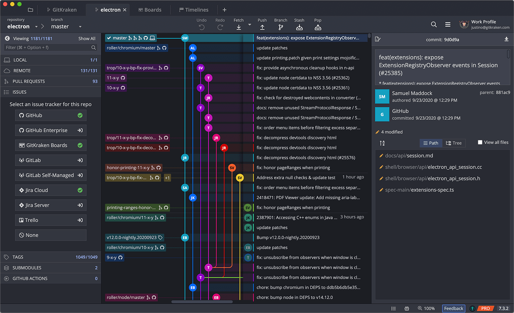
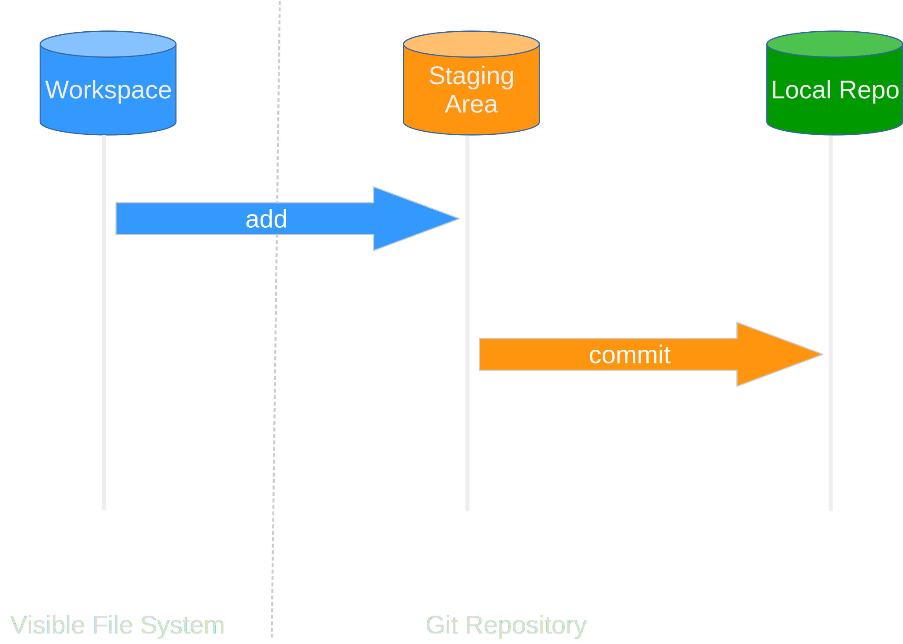
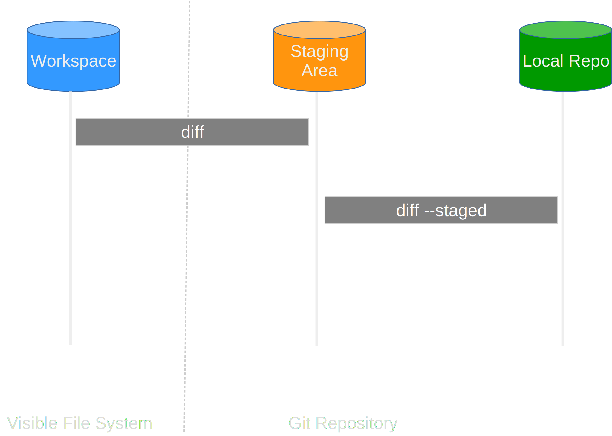
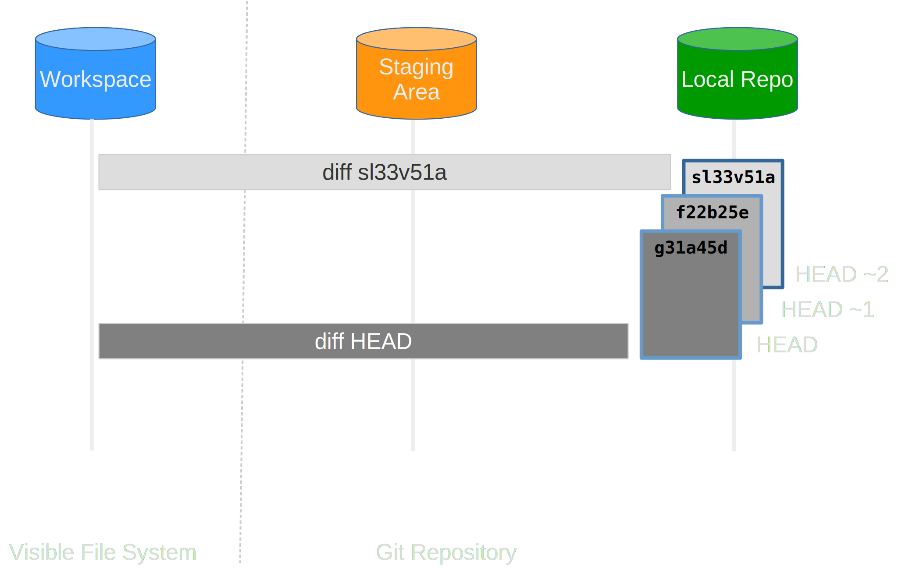
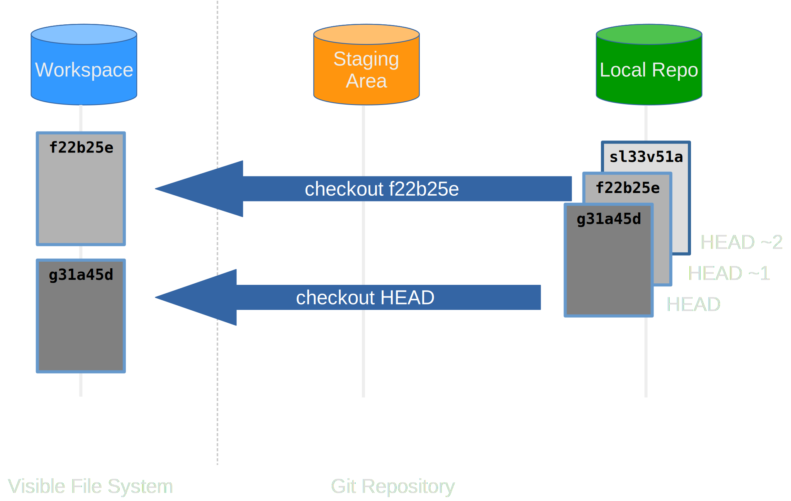
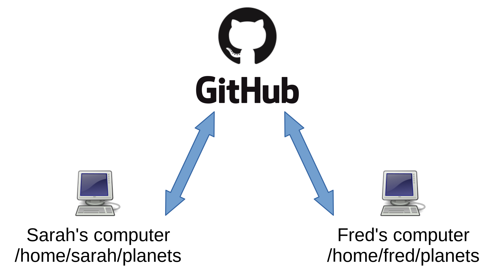
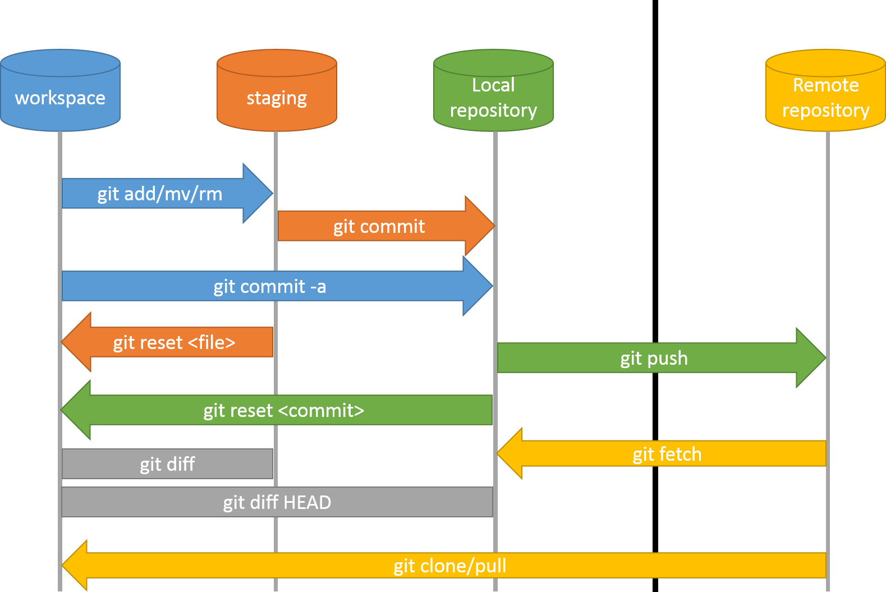

## Version Control with Git

## 0. Introduction

### Before We Start

- Create an account at [github.com](https://www.github.com)
- Open up a terminal
- Download the materials
- `git clone https://github.com/Southampton-RSG-Training/git-novice`

## 1. What is Version Control?

### What Does It Do?

- Tracks **changes** to files
- Any file can be tracked
- Text (.txt, .csv, .py, .c, .R, etc.) works best
  - These allow smart *diff* / *merge* etc.

### Why Use Version Control?

- A more <ins>efficient</ins> backup
- Reproducibility

### Why Use Version Control?

- Teamwork

### Version Control Tracks Changes

### Version Control Tracks Changes

### Version Control Tracks Changes

### Version Control Alternatives

- Git
  - Distributed
- Subversion (svn)
  - Centralised
- Mercurial (hg)
  - Distributed

- Git most widely used in academia
  - GitHub
  - GitLab

### Graphical Version Control

<table>
  <tr>
    <th>SourceTree</th>
    <th>Git Kraken</th>
    <th>Git Desktop</th>
  </tr>
  <tr>
    <td></td>
    <td></td>
    <td></td>
  </tr>
</table>

## 2. Setting Up Git

### Getting Demo Files

- `git clone https://github.com/Southampton-RSG-Training/git-novice`

### Key Commands

- `git config`

## 3. Creating a Repository

### Key Commands

- `git init`
- `git status`

## 4. Tracking Changes

### Key Commands

- `git add`
- `git commit`

### Adding & Committing

### History

- `git log`
- `git diff`

### Differences

## 5. Exploring History

### More Differences

### Restoring Files

- `git checkout`

### Restoring Files

## 6. Collaborating

### Local Repo

### Collaboration

### Remote Repositories

- Sign in to [github.com](https://www.github.com)
- Create repository
- `git remote add`
- `git push`

### Branches

### Creating branches

- `git branch dev`
- `git checkout dev`

### Branch files

- Create `rainfall_conversion.py`
- `git add rainfall_conversion.py`
- `git commit -m`

### Branches

### Branches

### Exercises

- Create a new branch called `doc` coming off `dev`
- Add a `README.md` file
- Commit your change to `doc`, then push
- Create a pull request on GitHub
- Merge `doc` into `dev`, and pull `dev` back

## 7. Conflicts

### Changes

### Conflicting changes

### Configure GitHub

- Go to your repository
- Settings -> Branches
- Switch default branch to 'dev'

### Branch 1

- `git checkout dev`
- `git checkout -b feature_cm`
- Add a line to the end of `rainfall_conversion.py` and commit
- `git push -u origin feature_cm`

### Branch 2

- `git checkout dev`
- `git checkout -b feature_m`
- Add a line to the end of `rainfall_conversion.py` and commit
- `git push -u origin feature_m`

### Pull requests

- Create a pull request from `feature_cm` to `dev`
- Create a pull request from `feature_m` to `dev`

### Conflict

- `git pull origin dev`
- Fix the conflict
- Commit and push
- Okay your pull request

### Remote workflows

## 8. Ignoring Things

### Key Files

- `.gitignore`
- `.gitkeep`
